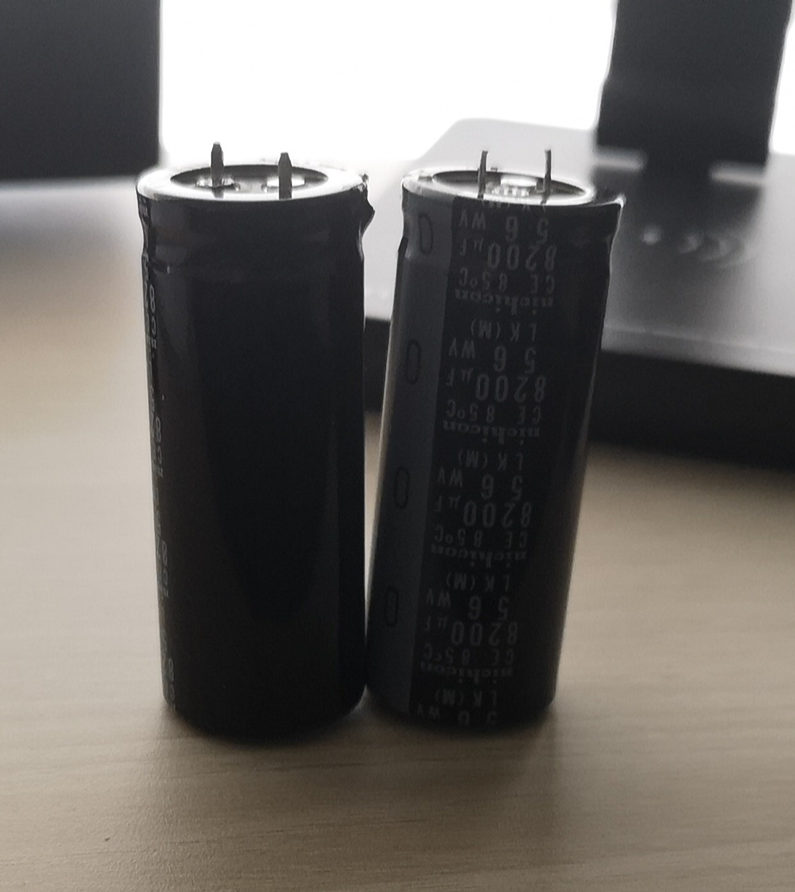
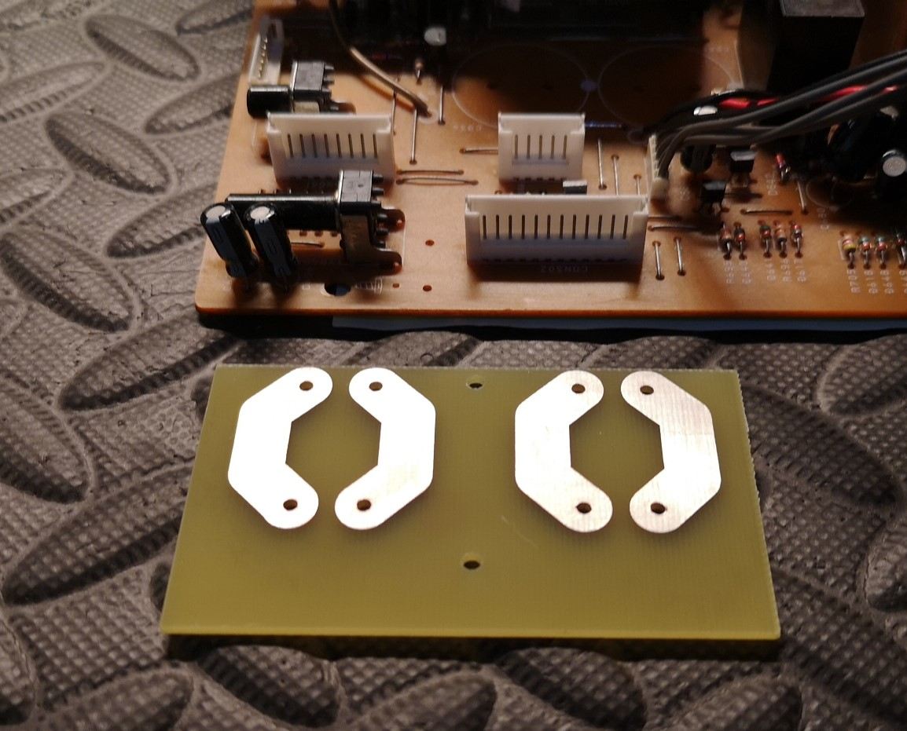
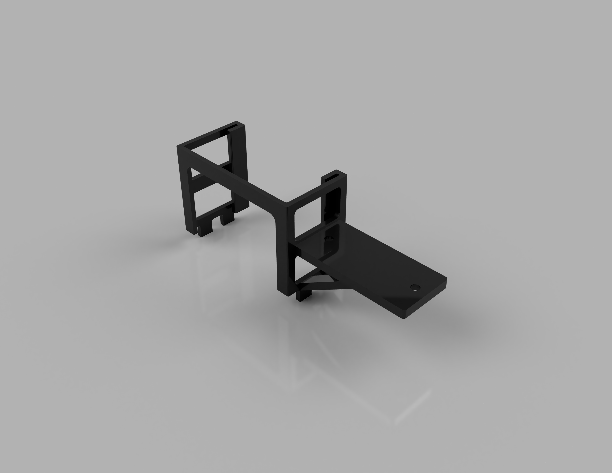
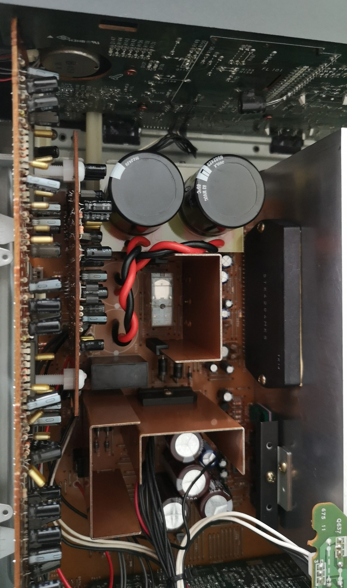

# AIWA HiFi

A repository where I track all the work I do for servicing my AIWA HiFi System.

## Repository Layout

The following is a summary of the directory layout used in this repository.

```
/
├── Boards/                  # All PCB-related hardware modules
│   ├── SomeBoard/           # A specific PCB module
│   │   ├── Capture/         # OrCAD Capture schematics (.dsn, .sch, .opj)
│   │   └── PCB/             # Allegro layout files (.brd)
│   ├── Libraries/           # OrCAD Capture schematic libraries (.olb, .lib)
│   └── Symbols/             # Allegro PCB symbols (.psm, .pad, etc.), padstacks, and STEP models
├── Designs/                 # Mechanical design files (e.g., Fusion 360)
├── Docs/                    # Reference documents, specs, notes, datasheets
├── Media/                   # Renders, images, screenshots, and visual content
├── PDFs/                    # Printable outputs for all boards:
│   │                        # - Assembly drawings
│   |                        # - Masks
│   │                        # - Schematics
│   │                        # - Drill charts
│   │                        # - BOMs
└── README.md                # Project overview and directory documentation
```

## MX-D10 Amplifier

### Audio Op-Amp Replacement

Due to audio performance issues, I tested the amplifier by injecting a signal and monitoring the output. While increasing the volume, one of the channels failed. Upon further inspection, I found that the installed audio power amplifier IC, the STK4204MK2, is rated for a maximum supply voltage of 55 VDC, whereas the measured rail voltage was approximately 56 VDC, exceeding the recommended limit.

It is likely that the unregulated power supply caused the rail voltage to rise from the nominal 51 VDC (as specified in the service manual) to approximately 56 VDC when the mains input increased from 220 VAC to 230 VAC, around 2003. However, this particular unit was not in use at that time. Additionally, under specific operating conditions, the supply rail transitions between 25 VDC and 51 VDC.

With the original IC damaged, a replacement was necessary; however, sourcing one proved challenging, as most of these devices are only available through aftermarket channels. I identified a reseller claiming to offer a genuine STK4204MK5, a compatible model featuring lower total harmonic distortion (THD) and a higher maximum supply voltage rating of 57 VDC.

Since the heatsink had to be completely disassembled, I took the opportunity to replace the thermal paste and apply thermal pads for improved thermal conductivity.

### Audio Op-Amp Capacitor Replacement

When I opened the MX-D10 amplifier I found that the filter capacitors for the audio operational amplifier were swollen:



Because I could not find capacitors that fit in the available space on the main PCB, I had to come up with an alternative. Based on the options available from authorized resellers, I designed a simple PCB to mount the new capacitors:



I designed a support to mount the PCB. It fits onto the heatsink of the bridge rectifier, near the capacitors being replaced:



The PCB is connected to the main board using manually twisted wires:



The PCB design is available in the [CapacitorBoard](Boards/CapacitorBoard/) directory and the design for the support in the [Designs](Designs/) directory.

### Filter Capacitor Replacement

Although the installed filter capacitors appeared to meet specifications, I opted to replace all of them.

## References

The service manual for the amplifier, the cassette deck, the tuner and the graphic equalizer is available [here](Docs/CU-D1000_ServiceManual.pdf). I could not find the service manual for the CD player and the turntable.
