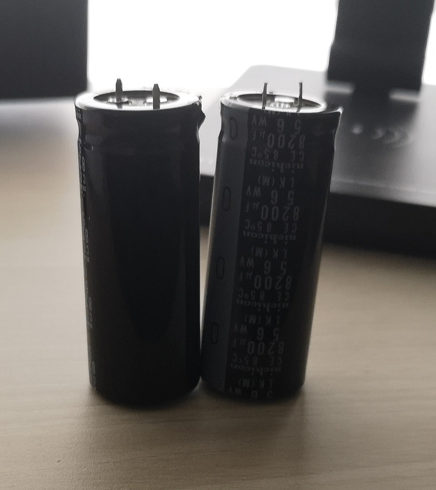
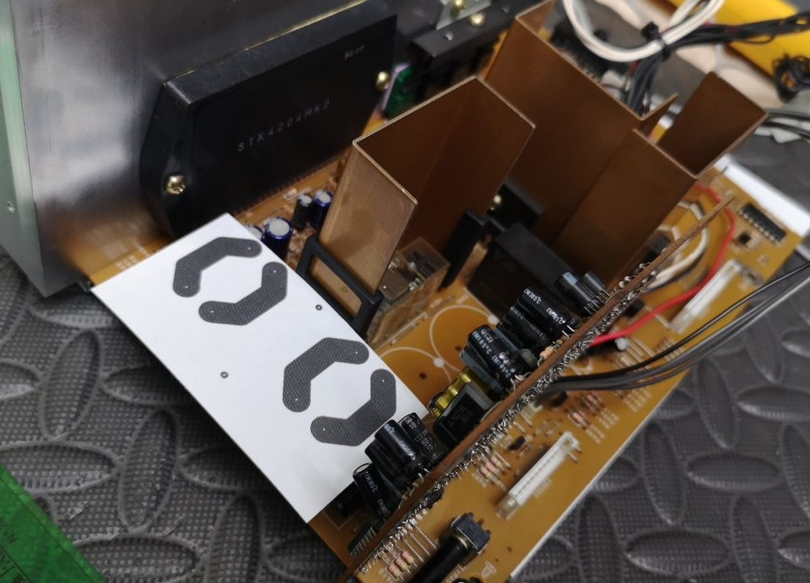

# AIWA CU-D1000 HiFi

A repository where I track all the work I do for servicing my AIWA CU-D1000 HiFi System.

## Repository Layout

The following is a summary of the directory layout used in this repository.

```
/
├── Boards/                  # All PCB-related hardware modules
│   ├── SomeBoard/           # A specific PCB module
│   │   ├── Capture/         # OrCAD Capture schematics (.dsn, .sch, .opj)
│   │   └── PCB/             # Allegro layout files (.brd)
│   ├── Libraries/           # OrCAD Capture schematic libraries (.olb, .lib)
│   └── Symbols/             # Allegro PCB symbols (.psm, .pad, etc.), padstacks, and STEP models
├── Designs/                 # Mechanical design files (e.g., Fusion 360)
├── Docs/                    # Reference documents, specs, notes, datasheets
├── Media/                   # Renders, images, screenshots, and visual content
├── PDFs/                    # Printable outputs for all boards:
│   │                        # - Assembly drawings
│   |                        # - Masks
│   │                        # - Schematics
│   │                        # - Drill charts
│   │                        # - BOMs
└── README.md                # Project overview and directory documentation
```

### Note

When opening schematics in OrCAD Capture, you may need to update the library paths, as Capture stores absolute paths for libraries, which can cause issues when the project is moved or cloned.

## MX-D10 Amplifier

### Audio Power Amplifier Replacement

Due to audio performance issues, I tested the amplifier by injecting a signal and monitoring the output. While increasing the volume, one of the channels failed. Upon further inspection, I found that the installed audio power amplifier IC, the **STK4204MK2**, is rated for a maximum supply voltage of **55 VDC**, whereas the measured rail voltage was approximately **56 VDC**, slightly exceeding the recommended limit.

It is likely that the unregulated power supply caused the rail voltage to rise from the nominal **51 VDC** (as specified in the service manual) to approximately **56 VDC** when the mains input increased from **220 VAC** to **230 VAC**, around 2003. However, this particular unit was not in use at that time. I also observed that increasing the volume causes the supply rail to step up from **25 VDC** to **51 VDC**.

With the original IC damaged, a replacement was necessary; however, sourcing one proved challenging, as most of these devices are only available through aftermarket channels. I identified a reseller claiming to offer a genuine **STK4204MK5**, a compatible model featuring lower total harmonic distortion (THD) and a higher maximum supply voltage rating of **57 VDC**.

Since I had to remove the heatsink to install the new IC, I took the opportunity to replace the old thermal paste with thermal pads to improve heat transfer from all regulators mounted to the heatsink, as well as from the new audio power amplifier IC.

### Audio Power Amplifier Filter Capacitor Replacement

When I opened the MX-D10 amplifier, I found that the filter capacitors for the audio power amplifier were swollen:



Since I could not find capacitors that fit in the available space on the main PCB, I had to come up with an alternative. Based on the options available from authorized resellers, I designed a simple PCB to mount the new capacitors:


I also designed a mechanical support to mount the PCB. It attaches to the heatsink of the bridge rectifier, which is located behind the capacitors being replaced:



The PCB is connected to the main board using manually twisted wires:


The PCB design is available in the [CapacitorBoard](Boards/CapacitorBoard/) directory, and the mechanical support design can be found in the [Designs](Designs/) directory.

### Filter Capacitor Replacement

Although the installed filter capacitors appeared to meet specifications, I opted to replace all of them.

## FX-W10 Cassette Deck

There was noticeable noise coming from the capstan motor of each deck, so I carefully disassembled them, cleaned all components, and lubricated the bearings. The noise is now nearly imperceptible.

## TX-D10 Tuner

The clock suffers from clock drift. I thought the ceramic crystal oscillator was the cause, so I replaced it. However, the drift still persists. I suppose I forgot those times when clocks needed periodic manual adjustments, so I’m not concerned about it.

## DX-D10 CD Player

I identified a couple of issues with the CD player.

One of them is read errors when playing slightly scratched discs. Although I purchased a CD optical pickup unit advertised as NOS (New Old Stock) to replace the existing one, I decided not to proceed, as the original unit still reads most discs without errors. Additionally, performance can be improved by fine-tuning the focus bias, tracking gain, and tracking balance.

The other issue was that the CD tray would close immediately after opening, preventing a disc from being placed on it. I fixed the issue by cleaning the switch that detects whether the tray is open or closed.

## References

The service manual for the amplifier, the cassette deck, the tuner and the graphic equalizer is available [here](Docs/CU-D1000_ServiceManual.pdf). I could not find the service manual for the CD player or the turntable.
